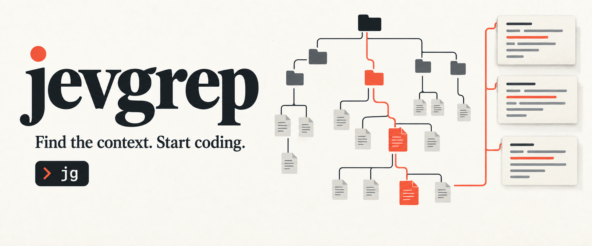
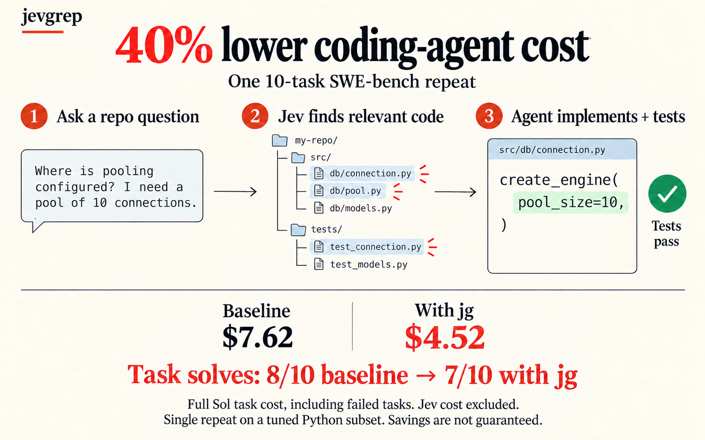

# jevgrep

[](https://www.npmjs.com/package/@dzhng/jevgrep)
[](LICENSE)
[](apps/cli/README.md)
[](https://github.com/dzhng/jevgrep/actions/workflows/publish.yml)

**Find code by asking what it does.**

Coding agents spend part of every unfamiliar task finding the right files.
Jevgrep gives them a place to start: ask a repository question, and `jg` returns
relevant files, reading leads, and verbatim source excerpts in one stdout response.
It uses [Jev](https://vercel.com/ai-gateway/models/jev) to judge relevance across
folders, files, and declarations. Your coding agent then implements and tests the change.

```sh
npm install -g @dzhng/jevgrep
jg auth
jg skill
jg "How are telemetry events recorded and sent?" ./my-project
```

Requires **Node.js 22+**, **macOS or Linux**, and a key for **Vercel AI Gateway, TypeSafe, OpenRouter, or OpenCode Zen**.
No separate Python, Bun, or ripgrep installation is required to use `jg`.

Provider selection requires **0.3.0 or newer**. Upgrade an older installation with
`npm install --global @dzhng/jevgrep@latest`.

## Install the agent skill — required for agent setup

Installing the CLI alone does not teach your coding agent to use it. **Install
the skill as well**, from the project where your agent works:

```sh
jg skill
```

The installer detects your coding agents (Claude Code, Codex, OpenCode and
others) and asks where to install. Add `--global` for a user-wide install, or
`--yes` for unattended installation. The
[skill](skills/jevgrep/SKILL.md) explains installation, invocation and the meaning of returned context.
It leaves research and implementation decisions to the calling agent. The current repository skill
checks for `jg` and installs the CLI if it is missing; authentication still needs
your selected provider’s key. The skill installer itself does not configure credentials.

`jg skill` delegates to the [skills CLI](https://github.com/vercel-labs/skills)
and needs npm/npx plus network access. You can also run that installer directly,
without the CLI installed:

```sh
npx skills add dzhng/jevgrep --skill jevgrep
```

In 0.1.0, `jg skill` only prints the bundled skill; use `npx skills` with that version.

### Upgrade

There is currently no `jg upgrade` command. Upgrade the CLI with npm:

```sh
npm install -g @dzhng/jevgrep@latest
jg --version
```

Update the installed skill separately by rerunning `jg skill`. Updating the npm package does not
overwrite skill files in your projects. See the [package guide](apps/cli/README.md)
for authentication details.

## Start with a question, leave with source

Use `jg` when you know the behavior you need to understand but not where it lives:

```sh
jg "Where is authentication checked before a request reaches a handler?" .
jg "How are database connections created, pooled, and closed?" ./src
jg "Which tests cover retry behavior when a request times out?" .
```

Jevgrep explores the repository hierarchy and follows qualifying branches. It
selects files using content previews, then identifies useful source units and
surrounding context. It keeps qualifying file locations even when it cannot
confidently return an excerpt; it does not force every search into a fixed top-two
list.

The summary and compact file list come first, followed by selected source with
line references, then detailed declaration and call locations. Python and TypeScript/JavaScript support declaration
parsing; other text uses a fallback. The output is evidence for the agent to use,
not a generated answer or a guarantee that every relevant file was found.
[See a recorded output example](specs/done/jevgrep/assets/stdout-example.txt).

When you already know an exact symbol or path, a direct read or `rg` search may be
all you need. Jevgrep is most useful for questions that span unfamiliar files.

## What we measured

**The final development cohort solved 8/10 tasks at about 28.6% lower
coding-agent cost than the saved no-Jev baseline**, which also solved 8/10.
Full Sol cost was $5.44 versus $7.62, including failures and excluding Jev.
These are ten tuned Python SWE-bench tasks; they do not establish general savings.

The cohort uses one frozen installed package and the exact neutral public skill
in this repository. See the [results, artifact identities, experiments and
limitations](evals/results/relevance-threshold-2026-09-27.md). Earlier cohorts and
out-of-scope agent-guidance trials remain separately identified.

The image below describes the **earlier historical run**, which saved about 40%
but solved 7/10 versus the baseline's 8/10. It is not the latest result.



The [historical report](specs/done/jevgrep/assets/variance-repeat.md) and
[evaluation guide](evals/README.md) retain the earlier evidence and methodology.

## Source, credentials, and local state

Searches send eligible source content to Jev through the provider selected during auth. Default
filesystem filtering respects ignore files and excludes hidden, dependency/build,
binary, and obvious credential files. These filters are not a guarantee that all
sensitive information has been removed; choose a search root you intend to send.

`jg auth` asks for your provider, then saves its key in an owner-only config file.
Re-running auth replaces that setup; searches always use the saved provider.
`jg doctor` checks it with synthetic input. Existing saved keys without a provider
remain Vercel keys. Environment-based credentials and endpoint overrides are not
used; run `jg auth` if you previously relied on them.
Evaluation answers are cached locally by default. The CLI writes its output to
stdout and does not create report files. Use `jg --help` for cache controls,
search overrides, and incomplete-result behavior.

## Development

The repository uses TypeScript, Bun workspaces, and Turborepo. From a checkout:

```sh
bun install --frozen-lockfile
bun run dev --help
bun run verify
```

Verification includes Docker tests of the installed Node-only package. For the
reasoning behind retrieval, parsing, caching, and failure handling, start with the
[architecture](docs/architecture.md) and [implementation record](specs/done/jevgrep/README.md).
[Release guidance](scripts/RELEASING.md) covers tag-triggered npm publication and
verification of the exact public package.

[MIT](LICENSE). [Artwork and generation prompts](assets/README.md).
