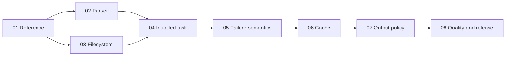

# Jevgrep product spec

Turn a coding agent's research question into relevant file locations and useful
source excerpts. Ship a Node-only CLI and explicit agent skill, using hierarchical
Jev classification through Vercel AI Gateway. This is the build plan; production search is implemented and acceptance verification is in progress.

## Next Agent Prompt

You are implementing this spec. Status: **implementing**, updated **2026-09-26**.
Next: prepare and run Django first in the isolated
[mechanism-first skill experiment](assets/query-framing-study.md).
The frozen `installed-jg-cpython-parity-v1` cohort is complete and not accepted:
7/10 solves versus 8/10 baseline, six cost wins, and 35.27% lower full Sol cost.
[Confirmation evidence](assets/cpython-confirmation.md) owns all outcomes, trace
findings and quality caveats. Never rerun a baseline, replace an attempt, or treat
the lower total as compensation for a lost solve. Keep the measured CLI unchanged
while testing any query/skill hypothesis as a separately identified candidate.

The merged `bun run verify` gate passed and whole-product review's sole finding
is fixed with a clean follow-up review. Exact archive checks pass on macOS arm64
and Linux arm64/amd64. [Runtime evidence](assets/python-runtime.md) records the
artifact and interpreter limits. The architecture port is verified for the
exercised corpus; task-quality acceptance failed and remains required.

`installed-jg-reference-parity-v1` is stopped and superseded. Requests and
scikit-learn officially solved but exceeded baseline cost; Django was interrupted
with its patch and traces retained; seven cells never started. These superseded
studies remain stopped. The bundled-CPython cohort is terminal; no Sol run is
active. The completed query diagnostics made only bounded Jev calls. A separately
identified skill candidate is prepared for an actual Django task test.

The changed-policy cohort `installed-jg-final-cohort-v1` was stopped and marked
superseded, retaining completed outcomes and interrupted traces. It is not a
release acceptance cohort. Never rerun saved baselines or pool candidates.
Report Jev observed API costs separately from scored full Sol cost.

Keep the restored expansion, discovery inputs/order, excerpt presentation, scoped
guidance and exact accepted skill (only rename executable to `jg`). Required
Node-only runtime, auth, cache, filesystem protections and truthful failure
handling remain, but must not silently change healthy retrieval decisions.
The earlier deterministic and platform gates passed for the deviating port;
they do not prove parity. See [parity restoration](assets/parity-restoration.md) and the
[source-budget investigation](assets/source-budget-decision.md).
Remaining: frozen quality confirmation, whole-spec review and close-spec.
See [contracts](contracts.md) for the corrected contract.

No user decision blocks starting. External verification dependencies are a working
Docker daemon, explicit Gateway credentials for live tests, retained official task
snapshots/baselines, and macOS access for native install verification. Missing live
inputs do not block deterministic development, but do block the corresponding
acceptance claim. Do not repair credentials or regenerate an existing baseline.

Implement one focused slice at a time, running its narrow tests and recording its
artifact. Use write-tests for behavioral tests and review before completing an
implementation pass. Update this section, slice status, decisions and unresolved
verification before ending each pass. These commands are targets to implement,
not claims about the current scaffold.

- [x] [01 — Reference and real HTTP fixture](slices/01-reference.md)
- [x] [02 — Bundled parser parity](slices/02-parser.md)
- [x] [03 — Filesystem eligibility and snapshots](slices/03-filesystem.md)
- [x] [04 — Installed CLI + skill + first real task](slices/04-checkpoint.md)
- [x] [05 — Faults, cancellation and partial results](slices/05-failures.md)
- [x] [06 — Default-on fresh cache](slices/06-cache.md)
- [x] [07 — Preserved output policy](slices/07-output-policy.md)
- [ ] [08 — Frozen quality and release verification](slices/08-release.md)

## Product and scope

User supplies `jg "question" [root]`; the CLI returns a summary, all qualifying
file locations, optional declaration leads, and selected verbatim excerpts. It
helps the caller begin with evidence; the caller still owns the patch and tests.
Threshold selection replaces fixed top-N file counts. No negative-path inventory,
generated answer, saved report, daemon, index, MCP server or UI.

Final v1 includes npm packaging and a tested publishing workflow on macOS/Linux,
Node-only runtime, auth/doctor,
Python and TS/JS parsing with text fallback, safe default eligibility, incomplete
results, default-on cache, and the agent skill. Cache persistence uses the same evaluator and retrieval pipeline.
No backward compatibility, data migrations or scaffold shims. Other providers,
Windows, Claude/DeepSWE benchmark expansion and untouched holdout research are
separate follow-ups. Keep personal-repository evals out of version control.

[Contracts](contracts.md) own the exact CLI, data shapes, defaults and semantics.
[Map](map.md) records the completed interview. [Research](research.md) owns
reference distinctions and accepted numerical evidence. The
[stdout sample](assets/stdout-example.txt) is the recorded frozen-reference HTTP-fixture packet,
not a live Jev result or another empirical prompt claim.

## Ladder and review surfaces

The first user workflow checkpoint is 04; 01–03 are independently runnable
prerequisite probes. Each slice produces one acceptance artifact named in its
file. CLI transcripts and installed-package journeys are the review surface;
there is no browser or screenshot requirement. Human feedback is non-blocking
for reversible implementation choices; evidence gates remain binding.

Docker tests run the built and then packed installed binary in a clean runtime,
with isolated HOME/XDG, fixture-only credentials, bounded resources and real HTTP
transport. Filesystem-writing integration tests must not touch the host. Give
focused commands for cases; reserve the full suite for closeout. Native macOS
installed verification complements Docker. Live Jev and downstream Sol tests are
separate from deterministic fixture tests; neither substitutes for the other.

## Single-owner invariants

Two production packages suffice: CLI owns interaction/process/rendering; core owns
retrieval. Within core, filesystem policy owns every read, snapshot owns all source
coordinates, source inspector owns syntax, request builders own prompt meaning,
evaluator owns all retries/request accounting, traversal owns frontier decisions,
selection owns source expansion, and cache owns persisted answers. Evaluation
harness owns baselines/official grades/billing and never ships in the npm package.

No second renderer or parser in eval tooling. The harness drives the real installed
CLI, while the frozen spike remains a read-only reference oracle. No runtime
compatibility adapter to old flags or personal-eval tooling. No source duplication
in cache. Selected and rendered ranges are distinct data, not competing owners.
The final code should read as designed today, not as experiments bolted together.

## Acceptance

Reconfirm one frozen production policy on the existing official ten-task Sol
cohort: preserve every baseline solve and achieve at least seven lower-cost
successful solves. Baselines are immutable per task/model/harness. Full coding-agent
cost includes retrieved text, reasoning, implementation and tests; Jev cost/tokens
are excluded. Retain unknown outcomes, failures and full traces. Timing is diagnostic,
not a gate. The historical eight solves and 37.784% total saving support the
architecture but do not automatically transfer to this implementation.

The sample was tuned and Python-only. TS/JS conformance tests establish parser
behavior, not downstream solve generalization. Arbitrary roots are supported by
contract; whole-computer effectiveness is not established by synthetic scale tests.

## Draft synthesis and fog audit

Three independent fresh-context drafts used the same interview brief: Codex with
fewest-slices and seam-quality biases; Claude Opus/high with a risk-first bias.
They agreed on installed-process testing, explicit owners, baseline reuse and
separate production quality confirmation. The minimal draft proposed three broad
slices; the seam draft ten; the risk draft prioritized oracle and parser probes.
This plan keeps two production packages, moves parser/filesystem risks before the
first task, and separates failures/cache/output evidence instead of bundling them
into a vague hardening phase.

Claude proposed Pyodide for closer CPython parity. The initial smaller grammar
parser failed that requirement; the measured fallback is now being integrated.
This reopens the parser mechanism, not the Node-only user contract. Do not
normalize semantically meaningful source or question order. The skill-path ambiguity was checked: the confirmation
hash matches the retained ranked-leads skill; the current working skill has changed.

Recursive fog audit: parser compatibility has its own artifact (02); eligibility
and snapshot integrity (03); service outcomes (05); freshness (06); numerical
source budget (07); actual task quality (08). Each open implementation freedom is
named in its owning slice. New behavior decisions outside those delegations reopen
the spec instead of becoming silent defaults. No untested representation change,
new recall heuristic or performance optimization hides in the integration slice.
