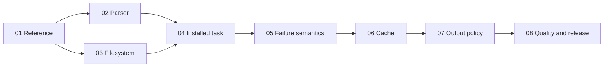

# Jevgrep product spec

Turn a coding agent's research question into relevant file locations and useful
source excerpts. Ship a Node-only CLI and explicit agent skill, using hierarchical
Jev classification through Vercel AI Gateway. This is the build plan; production search is implemented and acceptance verification is in progress.

## Next Agent Prompt

You are implementing this spec. Status: **implementing**, updated **2026-09-26**.
The corrected package's `installed-jg-freshness-v1` cohort is complete and
**rejected**: six of eight baseline solves preserved, four successful cost wins,
and 27.30% lower full Sol cost. [Current confirmation](assets/freshness-confirmation.md)
owns the complete aggregate and all ten trace comparisons. No coding, grading or
accounting process remains active; do not restart terminal sessions or attempts.

The freshness correction is integrated in `92ca7f9`. Full merged verification,
healthy reference parity and exact archive checks on all supported platforms
passed; [freshness evidence](assets/source-freshness.md) owns that proof and its
limits. Django and Requests still failed official behavior cases despite the
agent receiving the relevant code. This does not prove the correction or model
variance alone caused the losses.

Next: audit the final retained evidence and resolve the product-quality decision
with the user before changing the exact spike strategy or acceptance contract.
Do not rerun an unchanged cohort to seek a passing draw, replace attempts, pool
prior outcomes, or archive the spec as accepted. The choices ledger has been
consolidated against current code; final reconciliation and close-spec remain.

The preceding [accepted confirmation](assets/work-clock-confirmation.md) remains
valid for its own frozen archive. It cannot replace this corrected candidate's
failed result. Preserve both archives, the canonical skill and healthy retrieval
semantics. Rejected query/presentation experiments have not earned promotion.

Evidence and boundaries:

- [Runtime verification](assets/python-runtime.md): merged default tests,
  whole-product review, and exact archive checks on macOS arm64 and Linux
  arm64/amd64 passed. Interpreter parity is established for the exercised corpus,
  not all possible inputs.
- [Restoration record](assets/parity-restoration.md): frozen reference, known
  deviations and controlled request/output/recovery comparisons.
- [Completed first confirmation](assets/cpython-confirmation.md): rejected for
  losing a baseline solve despite lower total cost. Its traces remain evidence.
- [Query trial](assets/query-framing-study.md) and
  [presentation trial](assets/presentation-study.md): rejected experiments,
  source-parity probes and limits on causal explanations.

Priority: resolve the failed quality confirmation without silently weakening
acceptance or changing the measured strategy; then perform final reconciliation
and close-spec. Slice 08 remains open. No publication or
release tag is authorized for the intentional `0.0.0` development checkpoint.
Report observed Jev costs separately; they never enter scored Sol task cost.

Further strategy experiments or acceptance changes require an explicit direction
after reviewing the completed evidence. Preserve authorized credentials and retained
Docker snapshots; do not repair credentials or regenerate baselines. Preserve
user-edited skill files and local historical evidence. Stage only explicit files,
keeping deprecated personal-repository evals out of Git.

- [x] [01 — Reference and real HTTP fixture](slices/01-reference.md)
- [x] [02 — Bundled parser parity](slices/02-parser.md)
- [x] [03 — Filesystem eligibility and snapshots](slices/03-filesystem.md)
- [x] [04 — Installed CLI + skill + first real task](slices/04-checkpoint.md)
- [x] [05 — Faults, cancellation and partial results](slices/05-failures.md)
- [x] [06 — Default-on fresh cache](slices/06-cache.md)
- [x] [07 — Preserved output policy](slices/07-output-policy.md)
- [ ] [08 — Frozen quality and release verification](slices/08-release.md)

## Product and scope

User supplies `jg "question" [root]`; the CLI returns a summary, all qualifying
file locations, optional declaration leads, and selected verbatim excerpts. It
helps the caller begin with evidence; the caller still owns the patch and tests.
Threshold selection replaces fixed top-N file counts. No negative-path inventory,
generated answer, saved report, daemon, index, MCP server or UI.

Final v1 includes npm packaging and a tested publishing workflow on macOS/Linux,
Node-only runtime, auth/doctor,
Python and TS/JS parsing with text fallback, safe default eligibility, incomplete
results, default-on cache, and the agent skill. Cache persistence uses the same evaluator and retrieval pipeline.
No backward compatibility, data migrations or scaffold shims. Other providers,
Windows, Claude/DeepSWE benchmark expansion and untouched holdout research are
separate follow-ups. Keep personal-repository evals out of version control.

[Contracts](contracts.md) own the exact CLI, data shapes, defaults and semantics.
[Map](map.md) records the completed interview. [Research](research.md) owns
reference distinctions and accepted numerical evidence. The
[stdout sample](assets/stdout-example.txt) is the recorded frozen-reference HTTP-fixture packet,
not a live Jev result or another empirical prompt claim.

## Ladder and review surfaces

The first user workflow checkpoint is 04; 01–03 are independently runnable
prerequisite probes. Each slice produces one acceptance artifact named in its
file. CLI transcripts and installed-package journeys are the review surface;
there is no browser or screenshot requirement. Human feedback is non-blocking
for reversible implementation choices; evidence gates remain binding.

Docker tests run the built and then packed installed binary in a clean runtime,
with isolated HOME/XDG, fixture-only credentials, bounded resources and real HTTP
transport. Filesystem-writing integration tests must not touch the host. Give
focused commands for cases; reserve the full suite for closeout. Native macOS
installed verification complements Docker. Live Jev and downstream Sol tests are
separate from deterministic fixture tests; neither substitutes for the other.

## Single-owner invariants

Two production packages suffice: CLI owns interaction/process/rendering; core owns
retrieval. Within core, filesystem policy owns every read, snapshot owns all source
coordinates, source inspector owns syntax, request builders own prompt meaning,
evaluator owns all retries/request accounting, traversal owns frontier decisions,
selection owns source expansion, and cache owns persisted answers. Evaluation
harness owns baselines/official grades/billing and never ships in the npm package.

No second renderer or parser in eval tooling. The harness drives the real installed
CLI, while the frozen spike remains a read-only reference oracle. No runtime
compatibility adapter to old flags or personal-eval tooling. No source duplication
in cache. Selected and rendered ranges are distinct data, not competing owners.
The final code should read as designed today, not as experiments bolted together.

## Acceptance

Reconfirm one frozen production policy on the existing official ten-task Sol
cohort: preserve every baseline solve and achieve at least seven lower-cost
successful solves. Baselines are immutable per task/model/harness. Full coding-agent
cost includes retrieved text, reasoning, implementation and tests; Jev cost/tokens
are excluded. Retain unknown outcomes, failures and full traces. Timing is diagnostic,
not a gate. The historical eight solves and 37.784% total saving support the
architecture but do not automatically transfer to this implementation.

The sample was tuned and Python-only. TS/JS conformance tests establish parser
behavior, not downstream solve generalization. Arbitrary roots are supported by
contract; whole-computer effectiveness is not established by synthetic scale tests.

## Planning rationale and remaining boundaries

Three independent fresh-context drafts used the same interview brief: Codex with
fewest-slices and seam-quality biases; Claude Opus/high with a risk-first bias.
They agreed on installed-process testing, explicit owners, baseline reuse and
separate production quality confirmation. The minimal draft proposed three broad
slices; the seam draft ten; the risk draft prioritized oracle and parser probes.
This plan keeps two production packages, moves parser/filesystem risks before the
first task, and separates failures/cache/output evidence instead of bundling them
into a vague hardening phase.

Claude proposed Pyodide for closer CPython parity. The initial smaller grammar
parser failed that requirement; bundled CPython now executes the unchanged
reference helpers. [Runtime evidence](assets/python-runtime.md) records the
completed integration, verification and interpreter-version limits. The Node-only
user contract is unchanged. Do not normalize meaningful source or question order.
The incumbent skill matches the retained accepted instructions apart from the
executable rename; the separate skill experiment is not a production replacement.

Recursive fog audit: parser compatibility has its own artifact (02); eligibility
and snapshot integrity (03); service outcomes (05); freshness (06); preserved
output policy (07); actual task quality (08). Each open implementation freedom is
named in its owning slice. New behavior decisions outside those delegations reopen
the spec instead of becoming silent defaults. No untested representation change,
new recall heuristic or performance optimization hides in the integration slice.
