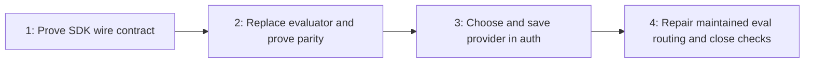

# Saved-provider support

Add native TypeSafe and OpenRouter to `jg`, using one TypeSafe-compatible AI SDK
adapter for all three services. Choose the provider once during authentication;
ordinary searches keep the same interface and retrieval behavior.

## Next Agent Prompt

You are implementing this plan, last updated 2026-09-26. **Status: specification
only; no provider implementation or live verification has happened.** Start at
[slice 1](slices/01-protocol.md): reproduce the pinned adapter against controlled
HTTP before changing production. Read [the evidence](research.md) and
[the preservation gates](parity.md). The completed [decision map](map.md) supplies
user rationale; this README and its slices now own implementation order.

You have no unresolved product question. Published-package behavior and live
provider access need verification, not invented compatibility code. Missing
credentials must not block offline implementation; report the missing live check
honestly. Do not collect secrets in chat or overwrite the user's own saved setup
for tests. Use isolated HOME/config/cache locations.

- [ ] [1. Protocol reproduction and controlled routing](slices/01-protocol.md)
- [ ] [2. Shared evaluator and production parity](slices/02-evaluator.md)
- [ ] [3. Saved-provider auth, installed journeys, and onboarding](slices/03-auth.md)
- [ ] [4. Maintained eval routing and final verification](slices/04-tooling.md)

Update this prompt and the owning slice with evidence, remaining work and any
deviations before ending each pass. Review each implementation slice before
committing. Keep the checkout clean on main; do not create orphan worktrees or
archive branches. There is no new benchmark run or npm publication in this plan.

## Roadmap and review surfaces

| Slice | Question answered                                          | Reviewable result                                                             |
| ----- | ---------------------------------------------------------- | ----------------------------------------------------------------------------- |
| 1     | Does the pinned adapter implement the documented protocol? | Synthetic HTTP transcript and pass/fail probe                                 |
| 2     | Can the new transport preserve existing retrieval?         | Built CLI reproduces the frozen corpus; failure and cache tests               |
| 3     | Does one setup reliably select the service?                | Installed Docker auth → doctor → search for every provider, plus native smoke |
| 4     | Does maintained tooling still observe the actual product?  | Offline broker/receipt fixtures and final verification record                 |

These are CLI/library checkpoints, with text transcripts as review artifacts.
There is no visual design or screenshot deliverable. Human feedback is welcome
but does not block reversible implementation; decide from the specified gates
and record the reasoning if no feedback arrives.

## Binding product contract

`jg auth` asks **provider first, then hidden key**. It saves one
`{provider, apiKey}` record. Re-running auth replaces that setup; searches and
doctor use it until replaced. No automatic provider fallback, account registry,
logout, or provider-switch command.

For automation, use `jg auth --provider <vercel|typesafe|openrouter> --stdin`.
The provider is mandatory with stdin. As a simplicity decision for this plan,
`--provider` is accepted only together with `--stdin`; interactive auth always
shows the picker. No provider/model/endpoint options on search or doctor.

Credentials come only from the saved record. Provider API-key, endpoint and model
environment variables cannot override it; XDG storage locations remain supported.
Auth saves without a network call; doctor separately tests a synthetic question
and identifies the saved provider. No secrets in stdout, exceptions or fixtures.

**The sole required backward compatibility:** absence of the `provider` property
means Vercel. Do not rewrite credentials during reads or require reauthentication.
A present invalid value, including null, is an error. No migration command,
format-version field, or preservation of environment-based authentication.

The selected provider receives the same eligible repository content as before.
Keep the existing head-friendly source packet, excerpts, stdout-only behavior,
exit semantics, filesystem exclusions, optional parsers and skill research policy.
No CLI report/trace files; only existing intentional auth/cache/skill persistence.

## Single owners and scope boundaries

| Concept                                                      | Owner                                                                     |
| ------------------------------------------------------------ | ------------------------------------------------------------------------- |
| Fixed provider IDs, labels, endpoint/model/protocol identity | One small core preset module                                              |
| Saved key/provider, config paths, validation, atomic writes  | CLI auth module                                                           |
| HTTP attempts, retries, cooldown, answer validation          | One evaluator using `@ai-sdk/typesafe-ai`                                 |
| Exact answer-cache storage                                   | Existing cache module; evaluator supplies namespace                       |
| Hierarchy, prompts, thresholds, batching, source freshness   | Existing retrieval/request/source owners, unchanged                       |
| Rendering and exit handling                                  | Existing CLI owners                                                       |
| Local HTTP redirection for verification                      | External test-owned Node preload, never packaged as product configuration |
| Paid-call forwarding and raw accounting                      | Maintained benchmark broker/runner                                        |

No second evaluator, provider plugin registry, hand-written native client, or
runtime protocol normalizer. Normalize transport only in tests. The intermediate
Vercel-only CLI wiring in slice 2 disappears when slice 3 passes saved provider
identity; it is not a compatibility layer to retain. Rename `gateway.ts` to
`evaluator.ts` with its imports when replacing the implementation, leaving no
forwarding module behind.

Preserve the 50,000 **actual HTTP attempt** guard solely as runaway protection,
SDK retries disabled, existing application retry/split policy, shared cooldown,
cancellation and source freshness on every attempt. No performance tuning,
prompt changes, new discovery strategy, parser changes, or benchmark optimization.

## Acceptance and limits

Each slice carries its focused gate. Final acceptance requires `bun run verify`,
`bun run format:check`, and the native packaged smoke, with all-provider installed
Docker journeys included in the normal suite. Freeze one candidate tarball and
run it through both installed Docker and native checks, recording its SHA-256.
Fixtures use actual SDK HTTP and installed CLI, not a mocked evaluator.

Perform bounded synthetic live doctor checks for providers whose credentials are
available through an authorized local source, using isolated saved records. Keep
those results separate from offline checks; unavailable credentials mean live
access is **unverified**, not failed or passed. A documented route that actually
rejects its preset is a correctness issue to resolve before claiming support.

Historical cost/quality claims retain their original scope. Jev cost is excluded
from scored coding-agent task cost, but available observed billing is preserved
separately; missing totals are unknown. No baseline reruns, personal-repo evals,
fresh SWE-bench cohort, speed claim, release version selection, or npm tag push.

## Plan audit

Three blind read-only drafts informed this plan: a fewest-slices draft proposed
one atomic change, a seam-focused draft proposed five stages, and Claude Opus's
risk-first draft proposed eight. This plan takes their shared protocol-first
gate, strict reference comparison and external routing seam. Four slices keep
auth/retrieval/tooling independently reviewable without making docs or packaging
separate workstreams. A single large slice would delay useful evidence; eight
would leave too many small migration boundaries to maintain.

Rejected alternatives: an internal baseURL override is unnecessary when fetch
redirection is test-owned; a multi-provider benchmark runner expands this feature
without helping product verification; interactive `--provider` adds a second way
to skip the required picker. Keep only the stdin automation form. Package notices
are part of the adapter/build gate, not deferred release cleanup.

The interview was completed in the map, including the user's explicit legacy
credential exception; no repeat permission or compatibility question is needed.
The roadmap front-loads protocol evidence, then preserves the existing product
before exposing additional auth choices. [Parity](parity.md) names each preserved
behavior, its evidence and owning gate. [Research](research.md) distinguishes
documented presets from unverified live access. Every slice names its remaining
implementation discretion; a choice outside that list requires updating this plan.
